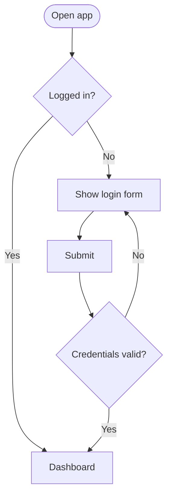
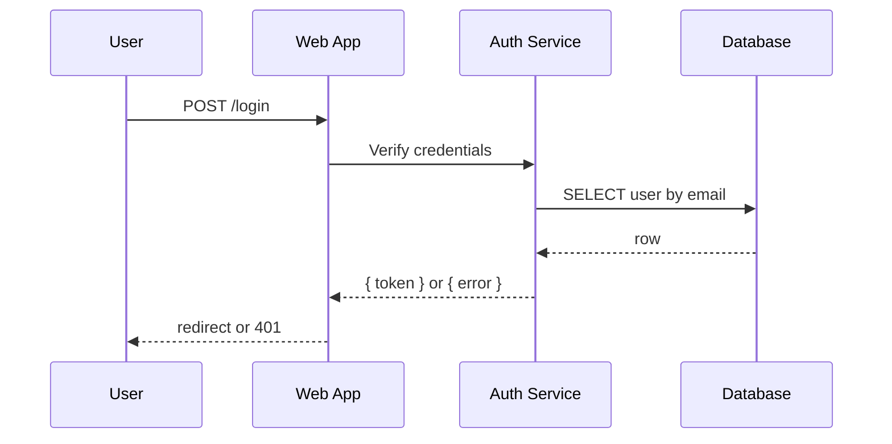

Flowcharts and sequence diagrams are the two most common Mermaid diagram types and the two that get mixed up most often. They look different but they answer different questions, and reaching for the wrong one tends to produce a diagram that takes more effort to read than the prose it was supposed to replace.

## The fast rule

Ask one question: **"Whose perspective is the reader following?"**

- **One perspective, branching choices** → flowchart. The reader walks one path and the diagram shows where the path forks.
- **Multiple perspectives exchanging messages** → sequence diagram. The reader watches several characters and the diagram shows what each one says when.

If your draft has actors holding conversations across a vertical timeline, you want a sequence diagram, even if it started as a flowchart. If your draft has one entity making decisions that branch, it is a flowchart.

## Worked example — login flow

The same login mechanic can be drawn either way. The flowchart describes **what the user experiences**:

That diagram fits if your audience is a product manager who cares about the user's path. It hides the database, the auth service, and the order in which they speak — they are not in the user's mental model.

The sequence diagram describes **what the systems do**:

That diagram fits if your audience is an engineer about to add caching, retries, or a third party to the auth dance. It hides the user's choices — there is no branching for "logged in?" because, by the time we are drawing this, that decision has been made.

## When you genuinely need both

Sometimes the answer is two diagrams in two sections of the same document. A common pattern:

1. **Lead with a flowchart** that orients the reader: here is the path through our product.
2. **Follow with a sequence diagram** for each step that involves multiple services.

The flowchart names what the sequence diagrams are about. The sequence diagrams fill in the technical detail without crowding the high-level path.

## Smaller cousins

Once you know the rule, the related questions become easier:

- **State machine** — same actor, but the question is "which states does it move through?" not "which path does it take?". Use a [state diagram](/diagrams/state/).
- **Org chart** — hierarchical, no time dimension. A flowchart with `LR` direction is fine; for very large hierarchies, [mindmap](/diagrams/mindmap/) reads better.
- **Database schema** — entities and relationships, no flow. [ER diagram](/diagrams/er/).

## Common mistakes when choosing

1. **Drawing a sequence diagram with one participant.** That is a flowchart with extra ceremony. Drop the swim lane and use a [flowchart](/diagrams/flowchart/).
2. **Drawing a flowchart that crosses lanes.** If your boxes are coloured "frontend" / "backend" / "database" and arrows hop between them, you are recreating swim lanes badly. Switch to a sequence diagram.
3. **Mixing message arrows and state arrows.** Pick one; the diagram cannot mean both at once.

When in doubt, draft both in [the preview](/preview/) and ask a teammate which one they read faster. The answer is usually obvious.
