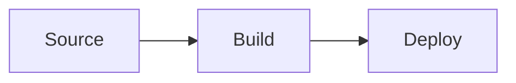
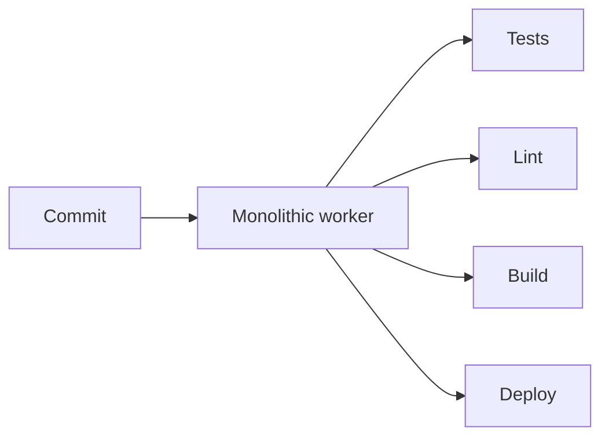

GitHub started rendering Mermaid blocks inside Markdown files in February 2022. That single change made "diagrams as code" the default for a generation of repositories — there is now no extra tool to install, no second URL to maintain, and reviewers can see updated diagrams in the same PR diff as the code.

## The basic block

Anywhere in a `.md` or `.mdx` file in a GitHub-hosted repo, a fenced code block with the language `mermaid` is rendered as an SVG:

````markdown

````

That is the entire integration. No GitHub Action, no external service, no settings to flip. The same block also renders in **issue comments**, **pull-request descriptions and comments**, **discussions**, **gists**, and **wikis**.

## Where it does not render

- **Project READMEs displayed inside an org page card** sometimes show the raw fenced block. The fix is to view the file directly.
- **GitHub Pages sites** built with Jekyll do **not** automatically render Mermaid — Pages serves the rendered HTML, and Jekyll's default Markdown processor does not know about Mermaid. See the [Hugo / Jekyll / VuePress guide](/guides/mermaid-in-hugo-jekyll-vuepress/) for the workaround.
- **Mobile diff view** in the GitHub mobile app currently shows the source instead of the rendering.

## Choosing a direction for README diagrams

GitHub renders the SVG at the column width of the README, which on most desktop screens is roughly 800–900 pixels. That has two consequences:

- **`flowchart LR` (left-to-right)** usually fits a single row better than `TD` (top-down), and feels less imposing on the page.
- **Diagrams beyond ~12 nodes** start to look small on mobile. If you have a complex pipeline, split it into two diagrams with a one-line caption between them.

## Versions and consistency

GitHub bundles its own Mermaid version, which lags slightly behind upstream. As of this writing it tracks v10.x, while the latest standalone release is v11.x. Most syntax is identical across these versions, but a few features added in v11 (notably `architecture-beta` and the new `kanban` keyword) will not render on GitHub yet.

When you draft a diagram in [our live preview](/preview/), pick a feature set that has been stable for at least one major version if the destination is a README — it saves a round-trip when you push and notice GitHub renders it differently.

## Worked example: an ADR diagram

Architecture Decision Records (ADRs) typically contain a "context" section that explains why a decision is necessary. A small flowchart often replaces three paragraphs of prose:

````markdown
## Context

The current pipeline runs every commit through the same monolithic worker:



We propose splitting the worker so each stage scales independently.
````

The diagram lives in the same file as the words that explain it. When the next ADR supersedes this one, both move together.

## Common mistakes

1. **Using ` ```mermaidjs ` or ` ```mermaid-js `**. The language tag is exactly `mermaid` — anything else falls back to a code block.
2. **Indenting the fence inside a list**. GitHub-flavoured Markdown allows fenced blocks inside lists, but the fences must be indented with the list (4 spaces under a 2-space list). Failing that, the rendering breaks silently.
3. **Pasting from a Word document**. Smart quotes (`"` `'`) and non-breaking spaces sneak in and Mermaid's parser rejects them. Paste through a plain-text intermediary if your editor does this.

## When to draft elsewhere

For long diagrams (50+ nodes, complex sequence flows), draft them in [our preview](/preview/) where you can see errors in real time and copy a share URL into the PR description so a reviewer can edit it before you commit. Once you are happy, paste the source into the README.
