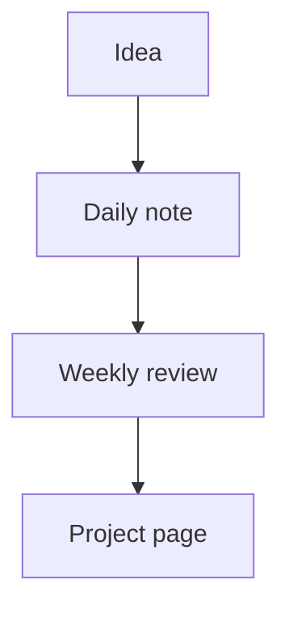

Mermaid has quietly become the lingua franca of diagrams in note-taking and documentation tools. The big three each render it natively, but with different keyboard shortcuts, theme behaviour, and renderer versions. This guide covers what to expect.

## Notion

Notion supports Mermaid inside `Code` blocks. Type `/code`, choose Mermaid as the language, paste the source, and click **Preview** in the bottom-right of the block to flip between source and rendering. The preview updates live, so you can iterate without leaving the page.

Things to know:

- **Theme** follows Notion's own light/dark mode. You cannot pick `forest` or `neutral` from inside Notion; the renderer chooses for you.
- **Maximum block height** is roughly the viewport. Tall diagrams scroll inside the block.
- **Sharing** publicly works the same as any Notion page — the rendered SVG is part of the page's public HTML.
- **Versioning** is whatever Notion ships. Diagrams that work today may render slightly differently in six months as Notion updates the renderer.

If you draft a diagram here and want a different theme, [our preview](/preview/) lets you switch to `dark` / `forest` / `neutral` and copy the rendered SVG; embed the SVG as an image in Notion if the look matters.

## Obsidian

Obsidian renders Mermaid inside fenced code blocks just like GitHub:

````markdown

````

Rendering happens locally in the Obsidian app, which is excellent for privacy and instant feedback. A few things to keep in mind:

- **Source mode vs reading mode** — Obsidian's "Live Preview" mode shows the SVG inline, while Source mode shows the fence. New users sometimes panic when their diagram disappears in Source mode; it has not been deleted, you just changed views.
- **Themes** can clash with Obsidian themes. Most community Obsidian themes look fine in `default`, but very dark themes can make the diagram unreadable. Use the Mermaid `%%{init: {'theme': 'dark'}}%%` directive at the top of the block to force dark.
- **Plugins** like "Mermaid Tools" add export buttons and tweak rendering. They are a fine quality-of-life upgrade once you outgrow the built-in renderer.

## GitBook

GitBook supports Mermaid via its standard "Code block" with `mermaid` as the language. Unlike Notion, GitBook publishes the rendered SVG to its public hosting, which means **anyone can view-source on a published GitBook page and recover your Mermaid source**. That is fine for public docs, but worth knowing if you are using GitBook as an internal-only knowledge base — treat your diagrams as world-readable.

## Drafting once, embedding everywhere

The shortest workflow is:

1. Draft in [our live preview](/preview/) — you see syntax errors immediately, you can pick a theme, and you get a share URL.
2. Once it renders the way you want, copy the source.
3. Paste into the destination tool's code block. None of the tools above require any modification of the Mermaid source.

If the destination tool's renderer chokes on something the preview accepts, you have probably hit a version skew. The most common culprits:

- **`%%{init: {...}}%%` directives** — older renderers ignore them silently.
- **`flowchart` keyword** — some renderers still want `graph` instead. They are aliases in modern Mermaid; use `flowchart` if your tools support it, fall back to `graph` only when required.
- **`stateDiagram-v2`** — the v1 keyword `stateDiagram` is deprecated but still works. Prefer v2.

## When tools fall short

If you need consistent rendering across Notion, Obsidian, and GitBook simultaneously, the only durable answer is to **render to SVG once and embed the SVG**. Notion accepts SVG image uploads, GitBook accepts them as image blocks, and Obsidian renders them through standard image links. The Mermaid source lives in a `.md` file in your repo so you can re-render later, but the published surface is a static image.

Use the SVG download button in the [preview](/preview/) to produce that file in one click.
