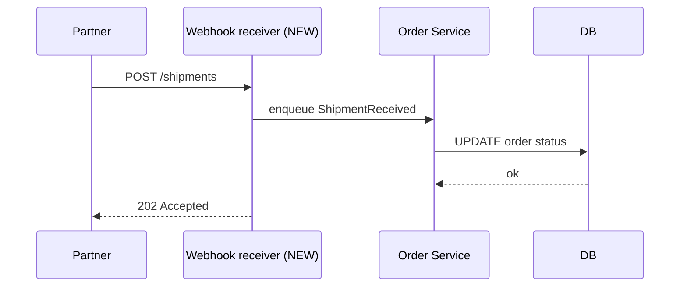
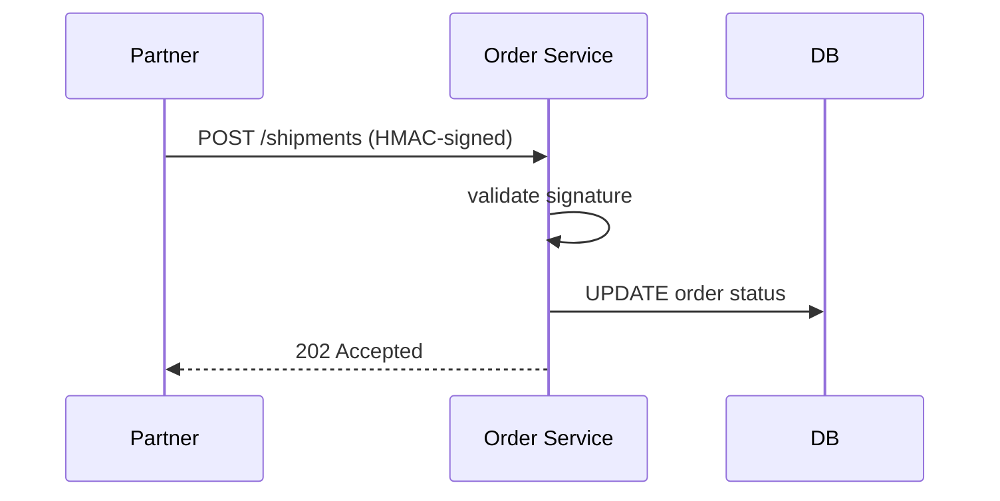

Mermaid in code review is one of those features that quietly changes how your team thinks. Once a reviewer can leave a comment that says "the diagram should look like this" with a working diagram inline, design discussions move out of meetings and into the PR. This guide is a short opinion piece on doing that well.

## Embed the diagram in the PR description

Whenever a PR changes architecture — a new service, a new API surface, a refactor of an auth flow — the description should include a Mermaid diagram of **the change**, not the whole system. Reviewers who haven't seen the codebase before can orient in seconds:

````markdown
## What this PR does

Adds a webhook receiver in front of the order service so partners can push
shipment events directly. The path becomes:


````

The diagram lives in the PR description, which means it is preserved in the merge commit message and shows up in `git log`.

## Reviewer comments can include diagrams too

GitHub renders Mermaid in PR comments. A reviewer who thinks the design should be different can paste a counter-proposal:

````markdown
> POST /shipments → Order Service directly?

If the partner can hit the order service directly, the webhook receiver
becomes a thin proxy. I'd consider:



Drops a process and a queue.
````

Two diagrams in two comments compare options far better than two paragraphs of prose.

## Use share URLs for quick edits

If the diagram in the PR has a typo or a small structural issue, a reviewer can:

1. Open the diagram in [our preview](/preview/) by pasting the source into the editor.
2. Edit it.
3. Click **Copy share URL**.
4. Paste the share URL into the PR comment with their suggestion.

The author opens the share URL, sees the suggested change rendered, copies the corrected source back into the PR. No file edits, no commits to throw away if the suggestion turns out to be wrong.

## Diagram-only PRs are fine

For documentation-only changes — a new ADR, an updated architecture overview — you do not need to bundle code. A PR that contains only `.md` changes with `mermaid` blocks is a perfectly normal PR, and it benefits from the same review tools as code: line comments, suggested changes, approvers.

Some teams keep these in a `docs/` directory, others next to the code that the diagram describes. Either is fine. The important property is that the diagram is in the same repo as the system it documents, so a search for "auth" turns up both the code and the diagrams.

## Things to avoid

A few patterns we have seen go wrong:

1. **Bikeshedding layout.** Mermaid auto-layouts. If a reviewer wants a specific layout, the answer is usually "no" — fighting the auto-layout produces a custom diagram that breaks on the next Mermaid version. Reserve layout review for genuine clarity issues, not aesthetic preferences.
2. **Diagrams that show too much.** A 30-node flowchart in a PR description is unreadable. Split it, link out, or move it to a permanent location with a one-paragraph summary in the PR.
3. **Diagrams that disagree with the code.** If your PR description shows a flow that the code does not implement, the description gets merged and lies in `git log` forever. Diagrams should be **part of the change**, not aspirational.
4. **Direct GitHub UI editing without the preview.** GitHub's Markdown editor does not render Mermaid live. You will commit broken diagrams. Always draft in the preview, paste in the PR, and check the rendered tab before submitting.

## A workflow we like

The default flow for a PR that touches architecture:

1. Author drafts the diagram in [the preview](/preview/), confirms it renders.
2. Author pastes the source into the PR description.
3. Author clicks the **Preview** tab in the PR description editor and confirms it still renders.
4. Reviewers comment with text or with their own Mermaid blocks.
5. The author updates either the diagram or the code (or both) before merge.

Five small habits, one durable outcome: every architecturally significant PR has a diagram, and every diagram lives where the system lives.
